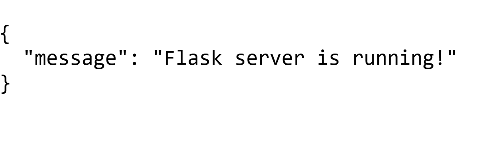
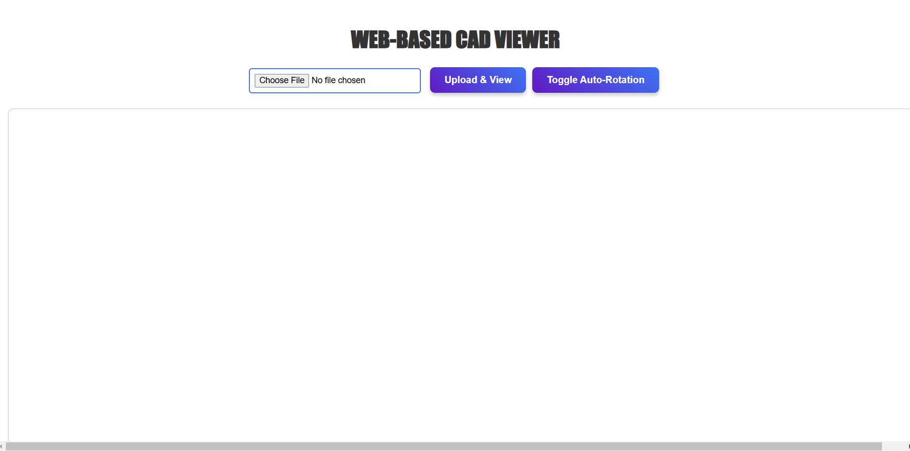
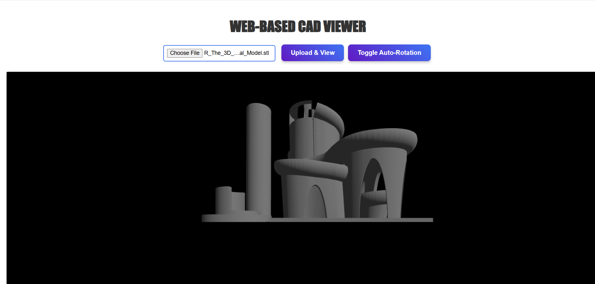
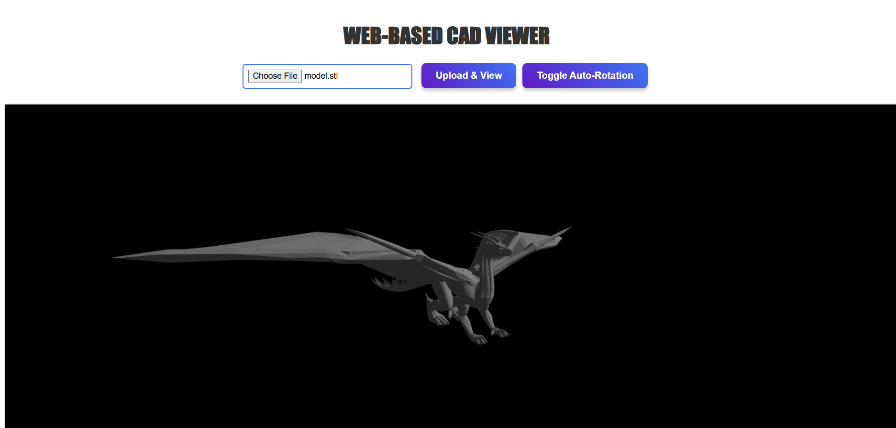

# 🖥️ Web-Based CAD Viewer<br>

A web-based 3D CAD model viewer that allows users to upload and visualize STL and OBJ files in an interactive 3D environment using Three.js, React.js, and Flask.<br>

## 🚀 Demo<br>
🔗 **Watch Demo Video**: [Click here](https://www.loom.com/share/0a11ca8c08ac4a388002ffa5e1554b20?sid=d85368e2-7dfb-4632-ae9e-aedd0439ea77)<br>

## ✨ Features<br>
✅ **3D Model Upload & Rendering** – Users can upload STL/OBJ files, and the viewer dynamically loads them into the scene.<br>  
✅ **Interactive Controls** – Rotate, zoom, and pan models using OrbitControls from Three.js.<br>  
✅ **Auto-Rotate Toggle** – Enable or disable automatic model rotation.<br>  
✅ **Flask Backend for File Uploads** – Models are stored on the server and retrieved dynamically.<br>  
✅ **Responsive UI** – Works on different screen sizes.<br>  

---  

## ⚙️ Tech Stack<br>  
- **Frontend**: React.js, Three.js<br>  
- **Backend**: Flask, Python<br>  
- **Styling**: CSS<br>  
- **Deployment**: Local development (can be extended to cloud hosting)<br>  

---  

<br>

---  

## 📸 Screenshots<br>  
Here are some screenshots of the application in action:<br>  

<br>  
<br>  
<br>  
<br>  
<br>  

---  

## 🚀 Setup & Installation<br>  

### 1️⃣ Clone the Repository<br>  
```bash
git clone https://github.com/arshadshaik0000/cad-viewer.git
cd cad-viewer-project
 


🚀 Setup & Installation
1️⃣ Clone the Repository
bash
Copy
Edit
git clone https://github.com/arshadshaik0000/cad-viewer.git
cd cad-viewer-project


2️⃣ Run the Backend (Flask)
bash

cd backend
pip install -r requirements.txt
python app.py
Backend will start at: http://127.0.0.1:5000/

3️⃣ Run the Frontend (React)
bash

cd frontend
npm install
npm start

Frontend will start at: http://localhost:3000/

🛠 API Endpoints


Method	Endpoint	Description
GET	/	Check if the server is running
POST	/upload	Upload a 3D model file
GET	/models/:filename	Retrieve an uploaded model


📌 How It Works<br>
1️⃣ Upload a 3D model file (STL/OBJ)<br>
2️⃣ The backend stores the file in the uploads/ folder<br>
3️⃣ The frontend fetches the model and renders it in Three.js<br>
4️⃣ Users can rotate, zoom, and pan the model<br>
5️⃣ Users can toggle auto-rotation<br>

👨‍💻 Future Improvements<br>
✅ Support for more 3D file formats (e.g., GLTF, FBX)<br>
✅ UI Enhancements – Improve responsiveness and design<br>
✅ Deployment on Cloud – Host the project online<br>


📜 License
This project is open-source under the MIT License.
