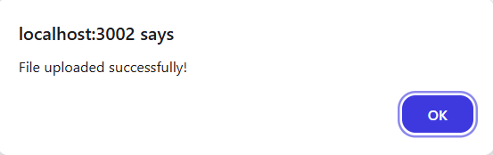

🖥️ Web-Based CAD Viewer

A web-based 3D CAD model viewer that allows users to upload and visualize STL and OBJ files in an interactive 3D environment using Three.js, React.js, and Flask.

🚀 Demo
🔗 Watch Demo Video https://www.loom.com/share/0a11ca8c08ac4a388002ffa5e1554b20?sid=d85368e2-7dfb-4632-ae9e-aedd0439ea77

✨ Features
✅ 3D Model Upload & Rendering – Users can upload STL/OBJ files, and the viewer dynamically loads them into the scene.\

✅ Interactive Controls – Rotate, zoom, and pan models using OrbitControls from Three.js.

✅ Auto-Rotate Toggle – Enable or disable automatic model rotation.

✅ Flask Backend for File Uploads – Models are stored on the server and retrieved dynamically.

✅ Responsive UI – Works on different screen sizes.

⚙️ Tech Stack
Frontend: React.js, Three.js
Backend: Flask, Python
Styling: CSS
Deployment: Local development (can be extended to cloud hosting)

## 📸 Screenshots  
Here are some screenshots of the application in action:  

  
  
  
  
  

🚀 Setup & Installation
1️⃣ Clone the Repository
bash
Copy
Edit
git clone https://github.com/arshadshaik0000/cad-viewer.git
cd cad-viewer-project

2️⃣ Run the Backend (Flask)
bash

cd backend
pip install -r requirements.txt
python app.py
Backend will start at: http://127.0.0.1:5000/

3️⃣ Run the Frontend (React)
bash

cd frontend
npm install
npm start

Frontend will start at: http://localhost:3000/

🛠 API Endpoints

Method	Endpoint	Description
GET	/	Check if the server is running
POST	/upload	Upload a 3D model file
GET	/models/:filename	Retrieve an uploaded model

📌 How It Works
1️⃣ Upload a 3D model file (STL/OBJ)
2️⃣ The backend stores the file in the uploads/ folder
3️⃣ The frontend fetches the model and renders it in Three.js
4️⃣ Users can rotate, zoom, and pan the model
5️⃣ Users can toggle auto-rotation

👨‍💻 Future Improvements
✅ Support for more 3D file formats (e.g., GLTF, FBX)
✅ UI Enhancements – Improve responsiveness and design
✅ Deployment on Cloud – Host the project online

📜 License
This project is open-source under the MIT License.
